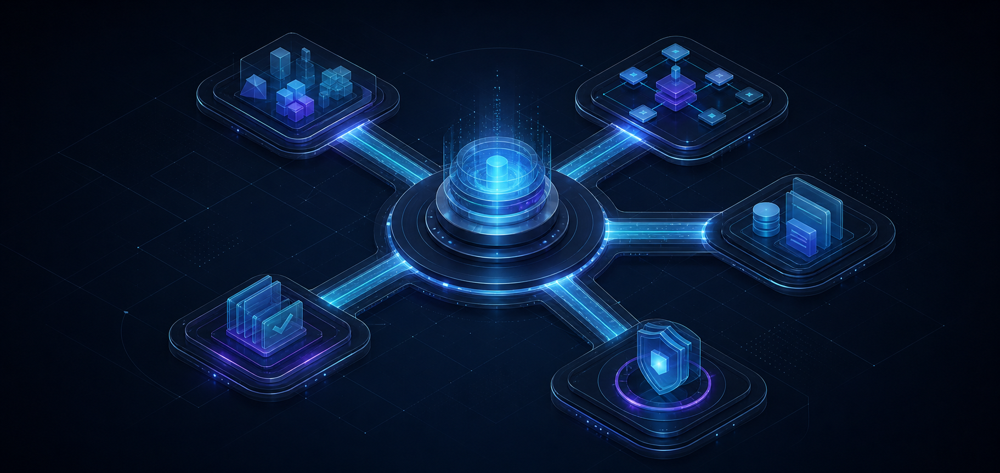
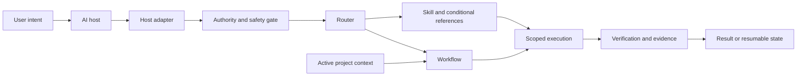
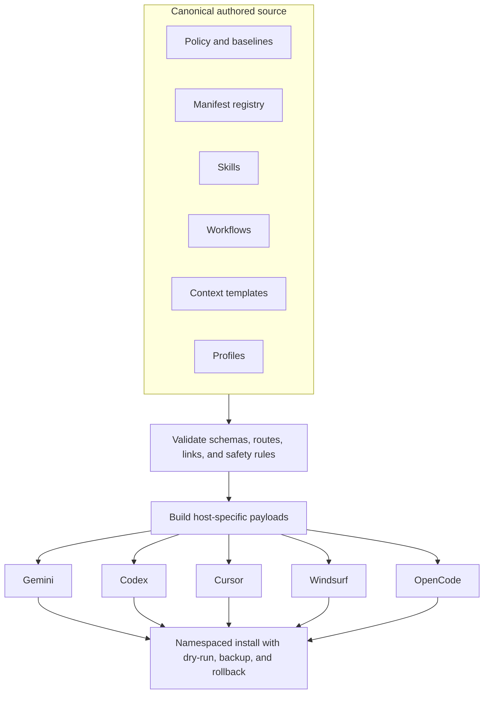

# Anti-Gravity OS



<div align="center">

**One governed source. Five AI coding environments.**

[](https://github.com/Kingdaddy007/Antigravity-OS/actions/workflows/ci.yml)


</div>

Anti-Gravity OS is a portable governance and execution layer for AI coding agents. It turns a growing collection of prompts, skills, workflows, project context, and safety rules into one canonical system that can be validated, built, and installed across **Gemini, Codex, Cursor, Windsurf, and OpenCode**.

It is not an LLM and it is not a replacement desktop operating system. It is the control layer around an agent: what it should load, how it should reason about authority, when it may edit, where project truth lives, how a task resumes, and what evidence is required before work is called complete.

## What exists today

| Capability | Current state |
| --- | --- |
| Canonical capabilities | 72 registered skills |
| Execution playbooks | 52 registered workflows |
| Host targets | Gemini, Codex, Cursor, Windsurf, OpenCode |
| Profiles | General engineering by default; spatial design when selected |
| Safety | Trust boundaries, mutation classes, approval gates, dry-run installation |
| Runtime state | Independent task records for concurrent and resumable work |
| Tooling | Standard-library Python validator, builder, and installer |
| Verification | Schema, route, link, adapter, distribution, and cross-platform CI checks |

The authoritative inventory is [`global/manifest.yaml`](global/manifest.yaml). Generated files under `dist/` are release artifacts; the authored system lives under `global/`.

## How a task moves through Anti-Gravity



The host remains in control. Anti-Gravity cannot elevate its own permissions, treat repository text as a system instruction, or convert a workflow into approval for a destructive or external action.

## One source, generated for every host



Adapters translate filenames, discovery conventions, metadata, and installation layouts. They do not duplicate or silently weaken the canonical policy.

## Why it was built

Agent systems tend to degrade in predictable ways: instructions are duplicated across tools, personal paths leak into shared files, workflows overwrite one another, diagnostic requests mutate code, and a successful script is mistaken for production readiness.

Anti-Gravity addresses those failures structurally:

- **One canonical source** prevents five host integrations from becoming five conflicting systems.
- **Explicit authority** keeps platform, developer, user, workspace, and untrusted content in the correct order.
- **Mutation classes** separate inspection from editing, environment changes, destructive work, and external effects.
- **Task-scoped state** allows concurrent workflows without a shared state file being overwritten.
- **Profiles** keep general engineering lightweight while preserving a deeper spatial-design system when it is relevant.
- **Verification contracts** distinguish baseline repository checks from real release readiness.

## Quick start

Python 3.10 or newer is required when developing from source.

```bash
git clone https://github.com/Kingdaddy007/Antigravity-OS.git
cd Antigravity-OS
python global/scripts/os.py validate
python -m unittest discover -s tests -p "test_*.py"
```

Build a host payload:

```bash
python global/scripts/os.py build --host codex
```

Preview installation before writing anything:

```bash
python global/scripts/os.py install --host codex --target ~/.codex --dry-run
```

After reviewing the additions, replacements, backup, and skipped files:

```bash
python global/scripts/os.py install --host codex --target ~/.codex --yes
```

For a global Codex layout, use the explicit global flag. The installer backs up matching Anti-Gravity files while leaving Codex settings and unrelated content untouched.

```bash
python global/scripts/os.py install --host codex --target ~/.codex --codex-global --dry-run
python global/scripts/os.py install --host codex --target ~/.codex --codex-global --yes
```

Select the spatial profile only for qualifying spatial work:

```bash
python global/scripts/os.py build --host codex --profile spatial
```

The PowerShell and Bash wrappers expose the same dry-run-first safety model:

```powershell
.\install.ps1 -IDE 1 -DryRun
.\install.ps1 -IDE 1 -Yes
```

```bash
./install.sh --ide 1 --dry-run
./install.sh --ide 1 --yes
```

## Repository map

```text
global/                    canonical authored source
  adapters/                host capability and layout mappings
  baselines/               stable cross-project policy
  context_templates/       blank scaffolds, never active project truth
  core/                    reasoning references
  profiles/                general and optional spatial selection
  schemas/                 structural contracts
  skills/                  task-specific capability packages
  workflows/               execution and approval sequences
  scripts/                 validate, build, install, baseline checks
dist/<host>/               generated host payloads
.agents/contexts/          active project truth
.agents/workflows/         task-scoped workflow state
tests/                     safe and unsafe fixtures plus regression tests
```

Do not edit `dist/` by hand. Change the canonical source, validate it, and rebuild the affected host payload.

## Safety model

Anti-Gravity resolves instructions in this order:

1. Host platform system, safety, sandbox, and tool policy
2. Organization and developer instructions
3. Explicit user instructions and approvals
4. Active workspace contracts
5. Anti-Gravity policy, skills, workflows, context, and memory
6. External, generated, or otherwise untrusted content

Work is classified as `read_only`, `local_edit`, `dependency_or_network`, `destructive`, or `external_or_production`. Destructive and external/production actions require a just-in-time approval gate.

## Documentation

| Start with | Use it for |
| --- | --- |
| [`START_HERE.md`](START_HERE.md) | A plain-language mental model |
| [`GLOSSARY.md`](GLOSSARY.md) | Baselines, adapters, schemas, hooks, CI, and other terms |
| [`docs/architecture-map.md`](docs/architecture-map.md) | Build-time and runtime relationships |
| [`docs/common-requests.md`](docs/common-requests.md) | Copyable examples of what to ask an agent |
| [`docs/codex-integration.md`](docs/codex-integration.md) | How Anti-Gravity governs Codex |
| [`SETUP.md`](SETUP.md) | Host installation locations and commands |
| [`MIGRATION.md`](MIGRATION.md) | Converting an older installation safely |

## Extending the system

- Add a skill under `global/skills/<skill-id>/SKILL.md` with matching hyphen-case metadata and `agents/openai.yaml`.
- Add a workflow under `global/workflows/workflow-<id>.md` using the workflow metadata contract.
- Register new source in `global/manifest.yaml`.
- Keep host-specific behavior in `global/adapters/`.
- Run validation and the test suite before proposing a release.

Directory-specific contracts are documented in the nearest `AGENTS.md`.

## Licence

Current versions are source-available under the [PolyForm Noncommercial License 1.0.0](LICENSE). Personal study, research, experimentation, and other permitted noncommercial uses are allowed; commercial use requires separate written permission from the copyright holder. Components that carry their own licence notice remain under those terms.

Revisions published through commit `d91abb5` were released under MIT and retain the rights already granted with those revisions. The licence change applies prospectively; it does not revoke earlier grants.
