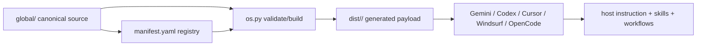
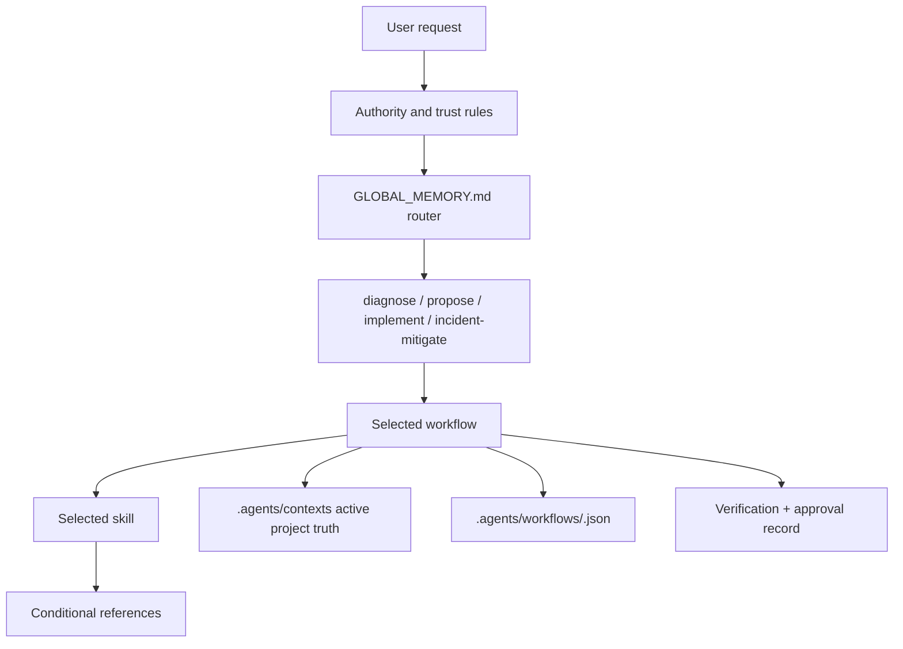

# Architecture Map

## Build-time relationship

## Runtime task relationship

`global/` is edited source. `dist/` is generated output. `.agents/contexts/` and `.agents/workflows/` are runtime project state. `USER_PROFILE.md` stores preferences only; it never overrides authority or grants permission.
