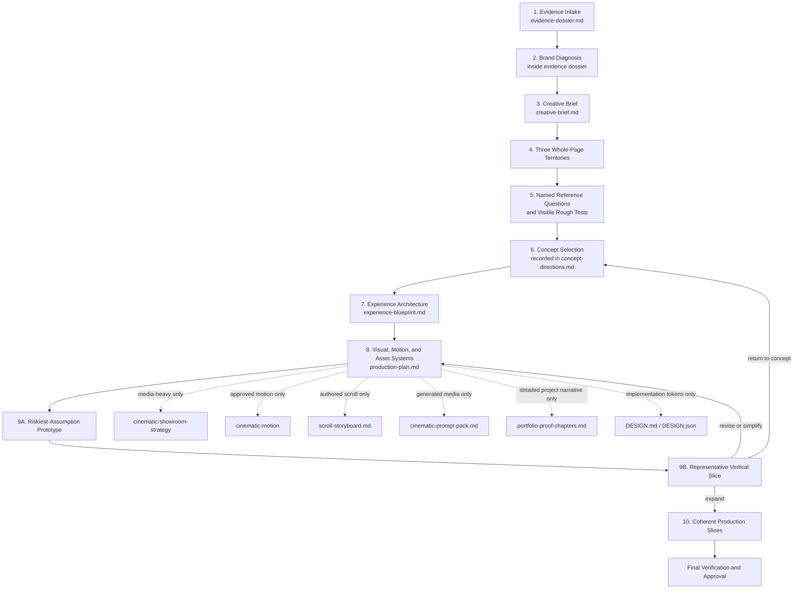

# BEVAMPED Design Workflow Repair Audit

**Status:** Local review draft
**Baseline:** `eacc013`
**Branch:** `repair/bevamped-workflow-v2`
**Installation status:** Not installed
**Commit / push status:** Uncommitted and unpushed
**Project 003 status:** Not started
**Revision 1:** Local Cognitive Engine gates and profile-resource closure restored after second audit

## Executive Verdict

The repair replaces the experimental 3.1.0 rewrite with a narrower change set based on the clean `eacc013` OS. It preserves the original specialist vocabularies and makes concept discovery, visible divergence, selection, risk prototyping, and controlled iteration explicit.

No skill or workflow was deleted. `cinematic-showroom-strategy` remains available as a conditional media-heavy specialist. Motion, video, anchor objects, generated media, scroll storyboards, and DESIGN files are no longer universal gates.

The source repair is ready for human diff review, not installation. Revision 1 restores explicit deep-thinking gates at high-stakes spatial decisions and makes the motion library spatial-only because its reference corpus is spatial. Codex remains exactly at the pre-refactor backup state.

## One-Page Architecture Map

### Governing distinction

Reusable niche jobs—point of view, curated work, transformation/design intelligence, proof, process/fit, and inquiry—remain available. Their presence, order, visual expression, and motion treatment are decided independently for each brand.

## File-by-File Ledger

Classification meanings:

- **Keep:** Preserved without modification.
- **Adapt:** Existing file changed narrowly to implement the approved contract.
- **Restore:** Capability removed by the experimental draft is retained from the clean baseline.
- **Add:** New file required by the approved contract.
- **Delete:** Removed from the canonical source.

| Classification | File | Reason and retained capability |
| --- | --- | --- |
| Adapt | `global/GLOBAL_MEMORY.md` | Added only spatial routing and five-contract descriptions; general modes, collision rules, deep loading, state maps, and technical preferences remain. |
| Adapt | `global/context_templates/README.md` | Documents the five contracts as logical coverage, not file-count law. |
| Adapt | `global/manifest.yaml` | Registers five templates for the spatial profile only; OS version remains unchanged. |
| Adapt | `global/skills/README.md` | Marks showroom, motion, and storyboard specialists as conditional. |
| Adapt | `global/skills/brand-strategy/SKILL.md` | Preserves perception gaps, taste worlds, enemy/counter-standard, premium signals/leaks, and examples; adds provenance and a non-visual creative-brief handoff. |
| Adapt | `global/skills/cinematic-motion/SKILL.md` | Preserves archetypes, four tracks, implementation patterns, easing, performance, and anti-patterns; adds stillness and semantic job-first selection. |
| Adapt | `global/skills/cinematic-motion/reference/canvas-frame-scroll-implementation.md` | Maps required choreography and boundaries to `production-plan.md` while accepting legacy files. |
| Adapt | `global/skills/cinematic-motion/reference/codrops-canvas-cylinder-gallery.md` | Routes required context to the production choreography contract. |
| Adapt | `global/skills/cinematic-motion/reference/infinite-parallax-gallery-loop.md` | Routes selected mechanics to production choreography rather than a universal legacy file. |
| Adapt | `global/skills/cinematic-motion/reference/lenis-gsap-scroll-foundation.md` | Keeps Lenis as infrastructure and points it to approved choreography. |
| Adapt | `global/skills/cinematic-motion/reference/on-scroll-layout-formations.md` | Keeps formation vocabulary; updates the context handoff. |
| Adapt | `global/skills/cinematic-motion/reference/scroll-driven-3d-cube.md` | Keeps cube guidance; updates the context handoff. |
| Adapt | `global/skills/cinematic-motion/reference/scroll-mapped-3d-camera-scenes.md` | Keeps camera-scene guidance; updates the context handoff. |
| Adapt | `global/skills/cinematic-motion/reference/video-to-website-choreography.md` | Keeps media choreography; makes it conditional and five-contract compatible. |
| Restore + Adapt | `global/skills/cinematic-showroom-strategy/SKILL.md` | Restores the specialist removed by the experiment and narrows activation to genuinely media-heavy work. |
| Adapt | `global/skills/master-design-director/SKILL.md` | Preserves quick/full/pushback/teaching/pre-build reviews and composition judgment; adds five stage gates and iteration discipline. |
| Adapt | `global/skills/motion-library/SKILL.md` | Preserves browsing and application; selects by communication job and permits stillness or simpler custom behavior; now ships only with the spatial reference corpus it requires. |
| Adapt | `global/skills/scroll-storyboard/SKILL.md` | Preserves beat taxonomy, registers, copy modes, transitions, and integration; makes storyboarding and anchor objects conditional. |
| Adapt | `global/skills/spatial-experience-design/SKILL.md` | Preserves archetypes, scene-kit guidance, asset boundaries, prompts, materials, and vocabulary; replaces fourteen universal artifacts with five logical contracts plus conditional outputs. |
| Adapt | `global/skills/spatial-experience-design/reference/audit-mechanics-map.md` | Keeps all audit mechanics as optional answers to named questions rather than mandatory citations. |
| Adapt | `global/skills/spatial-experience-design/reference/concept-forge-questions.md` | Moves exploration from escalating spectacle to three structurally distinct whole-page territories. |
| Adapt | `global/skills/spatial-experience-design/reference/scene-kit-and-asset-directive.md` | Preserves detailed asset and prompt fields; maps them to the selected concept and production plan. |
| Adapt | `global/skills/spatial-experience-design/references/extended-guidance.md` | Removes hidden fixed sequence/effect gates while preserving composition, proof, prompt, asset, and anti-pattern guidance. |
| Adapt | `global/skills/storytelling/SKILL.md` | Preserves proof choreography, copy direction, anti-patterns, and resource routing; adds multiple candidate narrative forms. |
| Adapt | `global/skills/storytelling/library/matching-guide.md` | Preserves all archetype/mechanic mappings; relabels them as candidates and risks to test. |
| Adapt | `global/skills/storytelling/reference/spatial-story-structures.md` | Preserves original forms and adds proof-first/point-of-view candidates; removes default status. |
| Adapt | `global/skills/ui-ux/reference/spatial-ui-system.md` | Preserves navigation, gallery, material, inquiry, accessibility, and responsive rules; replaces the fixed journey with reusable jobs. |
| Adapt | `global/workflows/README.md` | Documents the corrected sequence and conditional complexity. |
| Adapt | `global/workflows/workflow-impeccable-animate.md` | Keeps motion implementation responsibility but activates only after semantic and prototype gates. |
| Adapt | `global/workflows/workflow-impeccable-craft.md` | Replaces fourteen-file blocking with five-contract/equivalence checks and coherent production slices. |
| Adapt | `global/workflows/workflow-spatial-concept.md` | Becomes the explicit criteria-based selection workflow after visible territory tests, with a Type 1.5 cognitive and pre-mortem gate. |
| Adapt | `global/workflows/workflow-spatial-design-ui.md` | Adds UI responsibility mapping, risk prototype, representative vertical slice, Director verdict, and a dependency/assumption checkpoint. |
| Adapt | `global/workflows/workflow-spatial-project-inception.md` | Becomes the ten-phase orchestrator with explicit artifacts, approval gates, and evidence/inference diagnosis checkpoint. |
| Adapt | `global/workflows/workflow-storytelling.md` | Moves storytelling after concept selection into experience architecture and restores narrative-form assumption checks. |
| Adapt | `global/workflows/workflow-visual-brainstorm.md` | Moves divergence before selection, requires named reference questions plus visible rough tests, and restores Type 1.5 cognitive safeguards. |
| Add | `global/context_templates/evidence-dossier.md` | Source catalog, provenance, fact/inference separation, asset reality, and diagnosis. |
| Add | `global/context_templates/creative-brief.md` | Visitor response, first-known priority, proof burden, constraints, anti-goals, and selection criteria. |
| Add | `global/context_templates/concept-directions.md` | Three territories, references, rough tests, comparison, selection, and hybrid resolution. |
| Add | `global/context_templates/experience-blueprint.md` | Argument, narrative, chapter jobs, hierarchy, proof, inquiry, visual system, and responsive/motion intent. |
| Add | `global/context_templates/production-plan.md` | Assets, boundaries, conditional artifacts, fallbacks, risk prototype, vertical slice, slices, and verification. |
| Add | `global/skills/motion-library/references/semantic-index.md` | Routes communication jobs to candidate effect families and stillness. |
| Add | `tests/fixtures/spatial_behavior_scenarios.json` | Six full paper traces covering quiet, video-rich, transformation, material/process, proof-first, and SaaS cases. |
| Add | `tests/test_spatial_workflow_contract.py` | Regression tests for fixed-sequence/effect rules, conditional artifacts, explicit cognitive gates, profile resource closure, manifest routing, and scenarios. |
| Adapt | `tests/test_os_cli.py` | Extends every-host profile-isolation coverage to the spatial-only motion library. |
| Add | `docs/bevamped-design-workflow-repair-audit.md` | This human-readable review package. |
| Keep | All protected and unrelated source files | `GEMINI.md`, cognitive core, general inception/UI, engineering, security, database, API, DevOps, Seedance, prospecting, marketing, sales, and Project 003 remain unchanged. |
| Delete | None | No canonical skill, workflow, reference, or legacy project artifact was deleted. |

**Scope note:** The approved text says “nine” skills, while its named preservation list contains eight skills. This repair changes those eight named skills plus the direct spatial UI reference; no unnamed ninth skill was silently omitted.

## Cinematic Showroom Capability Migration Matrix

| Capability | Owner after repair | Activation | Status |
| --- | --- | --- | --- |
| Decide whether the project is media-heavy | `spatial-project-inception` + Director production gate | Evidence and selected concept justify multiple coordinated media states | Preserved, now conditional |
| Brand-to-scene translation | `cinematic-showroom-strategy` contribution to `experience-blueprint.md` | Media concept needs scene logic | Preserved |
| Section media choreography | `cinematic-showroom-strategy` contribution to `production-plan.md` | Video, canvas, frame sequence, or coordinated room films | Preserved |
| Text-safe zones and overlay planning | Showroom strategy + scene-kit directive | Text and media share authored compositions | Preserved |
| AI room-film continuity | Showroom strategy + cinematic room grammar + conditional prompt pack | Generated video is approved | Preserved |
| Prompt context inheritance | Showroom strategy + `cinematic-prompt-pack.md` | Generated images/video are required | Preserved, conditional artifact |
| Portfolio decision/proof integration | Showroom strategy + storytelling + optional `portfolio-proof-chapters.md` | Detailed project narratives exceed blueprint coverage | Preserved, shared ownership clarified |
| Motion implementation and performance | `cinematic-motion` + production plan | Approved motion job exists | Preserved, moved to implementation owner |
| Scroll-depth beat mapping | `scroll-storyboard` | Authored timing, pinning, continuity, or synchronized media exists | Preserved, conditional |
| Still/editorial alternative | Experience blueprint + Director gate | Motion/media adds no semantic value | Added explicit exit path |

No showroom capability was deleted. Ownership now separates strategic media necessity, scene/prompt planning, motion implementation, and scroll timing.

## Affected Capability Ownership

| Capability | Primary owner | Supporting owner / resource |
| --- | --- | --- |
| Evidence provenance and perception diagnosis | `brand-strategy` | `evidence-dossier.md` |
| Brief criteria and anti-goals | Spatial inception phases 2–3 | `master-design-director` Creative Brief Gate |
| Whole-page divergence and rough tests | `workflow-visual-brainstorm` | `spatial-experience-design` concept forge |
| Reference question and adaptation discipline | `spatial-experience-design` | audit map, storytelling matching guide, motion semantic index |
| Criteria-based concept selection | `workflow-spatial-concept` | Director Concept Selection Gate |
| Controlling argument and narrative forms | `storytelling` | storytelling library/resource index |
| Spatial archetypes, scene kit, asset boundary, material/depth vocabulary | `spatial-experience-design` | its retained references and global hero layout reference |
| Navigation, galleries, forms, accessibility, and responsive UI | `ui-ux` | spatial UI system and `workflow-spatial-design-ui` |
| Portfolio proof choreography | `storytelling` | spatial proof reference and conditional showroom strategy |
| Motion grammar, four tracks, easing, technical patterns, and performance | `cinematic-motion` | motion library candidates and technical resource index |
| Scroll beats, registers, copy modes, transitions, and continuity | `scroll-storyboard` | conditional `scroll-storyboard.md` |
| Taste judgment, stage approvals, subtraction, and iteration verdicts | `master-design-director` | retained professional/composition/Socratic references |
| Risk prototype and vertical slice | `workflow-spatial-design-ui` | Director prototype gate and `production-plan.md` |
| Coherent-slice implementation and verification | `workflow-impeccable-craft` | conditional `workflow-impeccable-animate` |

## Old vs New Project 003 Conversation Walkthrough

Project 003 is not being started here. This comparison shows how a future separately authorized Studio Bespoke Design inception would change.

| Moment | Old conversation | Repaired conversation |
| --- | --- | --- |
| Opening | “Run spatial concept; define the visual thesis, room sequence, hero event, object, depth, material, and motion.” | “What evidence do we have, what is fact versus inference, what is missing, and what perception problem does it demonstrate?” |
| Diagnosis | Brand analysis quickly hands off to spatial visuals. | Diagnosis ends with visitor response, first-known priority, proof burden, constraints, and anti-goals—without choosing visuals. |
| Ideation | Visual brainstorm waits for a mostly complete spatial contract and varies the approved thesis. | Three whole-page territories are generated before selection, including a restrained/still-led territory unless evidence rules it out. |
| References | Audit/Awwwards mechanics are expected inputs to a serious direction. | Each territory names design questions first; references answer those questions and record what will not be copied. |
| Making ideas visible | Written concepts can advance toward selection. | Every territory needs a rough styleframe, sequence, asset test, or micro-prototype before comparison. |
| Selection | The system's default spatial sequence and spectacle ceiling bias the direction. | Brand truth, first impression, proof, full-page value, assets, motion necessity, accessibility, performance, and maintenance determine selection. |
| Story | Atmosphere → Taste → Transformation → Proof → Method → Inquiry is compulsory. | Multiple narrative forms are compared; the brand's first-known priority controls order. |
| Motion | Hero event, four tracks, anchor object, showroom choreography, and motion library are default expectations. | Stillness is valid. Motion, video, anchor objects, storyboards, and showroom planning activate only when their semantic tests pass. |
| Production | Fourteen files gate mockup/code; major uncertainty may survive until broad build. | Five logical contracts or equivalents lead to the riskiest-assumption prototype and one representative vertical slice before expansion. |
| Iteration | Changes during build can feel like failure or unstructured deviation. | Early tests can change the concept; later changes return to the earliest invalidated gate and are recorded. |

## Six Behavioral Paper Traces

The full machine-readable traces are in `tests/fixtures/spatial_behavior_scenarios.json`.

| Scenario | Leading logic | Conditional complexity decision | Handoff |
| --- | --- | --- | --- |
| Quiet still-image studio | Atmosphere/editorial restraint supported by strong stills | Reject showroom, cinematic motion, and storyboard | Static vertical slice, then coherent slices |
| Video-rich studio | Multiple room films perform section-specific jobs | Activate showroom, motion, and storyboard with fallbacks | Media-aware production slices |
| Transformation-led decorator | Before/after evidence and decisions lead | Detailed project proof accepted; authored scroll rejected unless testing proves need | Transformation/proof slice first |
| Material/process-led studio | Sourcing and design intelligence lead | Reject media spectacle; use crop, captions, and sequence | Material/process slice first |
| Architecture-adjacent proof-first | Rigor and project facts establish authority | Reject forced atmosphere-first order and unnecessary motion | Authority/comprehension slice first |
| General SaaS/product UI | General product and UI workflow | Reject entire spatial profile | General UI craft; no spatial artifacts or gates |

Each trace records selected skills, workflow, loaded files, conversation sequence, artifacts, approval gates, optional complexity, rationale, and expected handoff.

## Verification Evidence

- Canonical validator: passed.
- Full unit suite: 25 tests passed.
- New spatial contract suite: 9 tests passed.
- All supported hosts build in the existing suite.
- Spatial profile remains optional.
- General Codex payload excludes all spatial workflows, five spatial templates, and the spatial-only motion library.
- General manifest `next_workflows` routes do not depend on spatial-only workflows.
- All resources owned by the eight affected skills are reachable from their `SKILL.md` or resource index.
- Generated Codex general and spatial payloads prove the motion library is absent without its cinematic corpus and present with its required corpus.
- Five high-stakes spatial workflows explicitly load all three Cognitive Engine references; a regression test protects those gates.
- Affected `SKILL.md` files remain below the 15 KB skill-authoring limit.
- Protected source changes: none.
- Codex backup comparison: `skills` 329/329, `workflows` 49/49, `antigravity` 321/321, zero hash mismatches; root `GLOBAL_MEMORY.md`, `AGENTS.md`, and `USER_PROFILE.md` match.
- Experimental draft preserved as stash message `pre-repair-os-3.1-experimental-draft`.

## Exact Diff Statistics

Compared with `eacc013`, including untracked files in this review branch:

- **Changed or added files:** 45
- **Additions:** 1,905
- **Deletions:** 1,585
- **Deleted files:** 0

The largest deletions are duplicated legacy workflow procedures that enforced fourteen artifacts and fixed sequencing. Their specialist vocabularies remain in the retained skills and references, and their capabilities are mapped above.

## Unresolved Risks

1. **Paper traces are not live-model smoke tests.** Deterministic tests prove routing and contract consistency, but a fresh Codex task must run the six scenarios after an approved install.
2. **Workflow compression requires human review.** Coordination files are shorter because detailed technical knowledge now remains with specialist skills/references. The ledger and capability matrix should be checked for any vocabulary the user still wants duplicated at workflow level.
3. **Legacy and five-contract documents can coexist.** Compatibility avoids destructive migration but creates temporary naming ambiguity. A future project should map equivalents explicitly rather than maintain both casually.
4. **General Impeccable prose contains pre-existing mentions of visual brainstorm.** Protected general workflows were not edited. Canonical manifest routing and payload isolation pass; if those prose mentions are intended as executable dependencies, that is a separate general-OS audit.
5. **Text-based contradiction tests have limits.** They catch known compulsory phrases and structural regressions, but human review must still detect new wording that recreates the same bias.
6. **Version remains `3.0.0`.** No version or global decision-memory entry was written before behavioral approval, as required.
7. **The repaired source is not active in Codex.** Codex intentionally remains on the verified pre-refactor backup until a separate installation approval.

## Rollback Path

Current rollback is low-risk because nothing is committed, pushed, installed, or merged.

1. Preserve this repair in a named stash if review pauses.
2. Return the canonical repository to `main` at `eacc013`.
3. Keep or discard the repair branch only after the user decides.
4. Recover the experimental draft by stash **message**, not by assuming its numeric index remains `stash@{0}`.
5. Codex needs no rollback now; it already hash-matches the pre-refactor backup.
6. `.gemini` was never modified and requires no action.

## Approval Boundary

Approval of this audit should authorize only the next specified step. The planned sequence remains:

1. User reviews this document and the source diff.
2. On approval, create one local repair commit.
3. Build the Codex spatial payload.
4. Show a dry-run with exact additions, replacements, and removals.
5. Install only after a separate approval.
6. Run the six live routing smoke tests in a fresh Codex task.
7. Handle Gemini namespace collision separately.
8. Begin Studio Bespoke Design only through a separately authorized Project 003 inception.
